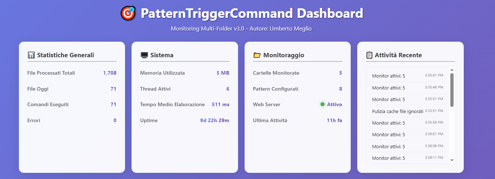

# 🎯 PatternTriggerCommand Multi-Folder with Web Dashboard

*Author: Umberto Meglio - Development Support: Claude by Anthropic*

## 🌟 Project Overview

PatternTriggerCommand is an advanced Windows service application that monitors multiple folders simultaneously for new or modified files matching configurable regex patterns. When a matching file is detected, the service automatically executes associated command scripts or applications, passing the complete file path as a parameter.

This latest version introduces a **comprehensive web dashboard** for real-time monitoring, advanced metrics collection, and enhanced system observability, making it a complete enterprise-grade automation solution.



### ⚡ Key Features

- **🗂️ Multi-Folder Monitoring**: Native support for monitoring different folders with specific patterns
- **🎯 Pattern-Based Monitoring**: Uses regular expressions to identify files of interest
- **⚙️ Automated Command Execution**: Triggers customized commands when matching files are detected
- **🧠 File Processing Tracking**: Maintains a database of processed files to prevent redundant processing
- **📊 Real-Time Web Dashboard**: Modern HTML5 dashboard with live metrics and monitoring
- **🌐 REST API**: JSON endpoints for system integration and external monitoring
- **📈 Advanced Metrics Collection**: Memory usage, processing times, thread monitoring, and performance analytics
- **📝 Detailed Logging**: Comprehensive activity logs with configurable verbosity
- **🔄 Multiple Operation Modes**: Windows service or console test mode with web interface

### 🏗️ Technical Specifications

- **💻 Development**: Built in C++ using Windows API with modern C++11 features
- **⚡ Performance**: Asynchronous I/O operations with multi-threaded architecture
- **🌐 Web Interface**: Integrated HTTP server with responsive dashboard
- **🔄 Architecture**: Event-driven file monitoring with real-time metrics
- **🛡️ Reliability**: Robust error handling, graceful shutdown, and recovery system
- **🔒 Safety**: File locking detection and concurrent access management
- **📊 Scalability**: Optimized for enterprise environments with performance monitoring

## 🚀 Quick Installation

### ⚒️ Compilation

```bash
# With MinGW
G:\mingw32\bin\mingw32-make.exe

# Or if MinGW is in PATH
mingw32-make
```

### 📦 Service Installation

```bash
PatternTriggerCommand.exe install
```

### ⚙️ Basic Configuration

The service automatically creates a sample configuration file at `C:\PTC\config.ini` on first startup.

## 🛠️ Advanced Configuration

### 📋 Multi-Folder Configuration Format

The `C:\PTC\config.ini` file supports flexible configuration with web dashboard settings:

```ini
[Settings]
DefaultMonitoredFolder=C:\Monitored
LogFile=C:\PTC\PatternTriggerCommand.log
DetailedLogFile=C:\PTC\PatternTriggerCommand_detailed.log
ProcessedFilesDB=C:\PTC\PatternTriggerCommand_processed.txt
DetailedLogging=true
WebServerPort=8080
WebServerEnabled=true

[Patterns]
# Extended format: Folder|Pattern|Command
Pattern1=C:\Invoices\Incoming|^invoice.*\.pdf$|C:\Scripts\process_invoice.bat
Pattern2=C:\Reports\Monthly|^[0-9]{8}_.*DEMAT.*\.csv$|C:\Scripts\process_demat.bat
Pattern3=C:\Documents\Contracts|^contract.*\.docx?$|C:\Scripts\process_contract.bat

# Compatible format: Pattern|Command (uses default folder)
Pattern4=^backup.*\.zip$|C:\Scripts\process_backup.bat
```

### 🌐 Web Dashboard Configuration

- **WebServerPort**: Configure the dashboard port (default: 8080)
- **WebServerEnabled**: Enable/disable the web interface (default: true)
- Dashboard URL: `http://localhost:8080`
- API endpoint: `http://localhost:8080/api/metrics`

### 🎨 Regex Pattern Examples

```ini
# Files with date and specific text
Pattern1=C:\Data|^[0-9]{8}_.*DEMAT.*\.csv$|C:\Scripts\process_demat.bat

# Invoice PDFs
Pattern2=C:\Invoices|^(invoice|fattura).*\.pdf$|C:\Scripts\process_invoice.bat

# Office documents
Pattern3=C:\Docs|^report.*\.(xlsx?|docx?)$|C:\Scripts\process_office.bat

# Timestamped files
Pattern4=C:\Logs|^log_[0-9]{4}-[0-9]{2}-[0-9]{2}.*\.txt$|C:\Scripts\process_log.bat
```

## 💻 Command-Line Interface

### 🔧 Service Management

```bash
PatternTriggerCommand.exe install        # Register as a Windows service
PatternTriggerCommand.exe uninstall      # Remove the service registration
PatternTriggerCommand.exe test           # Run in console mode for testing
PatternTriggerCommand.exe status         # Display service status and configuration details
```

### 💾 Database Management

```bash
PatternTriggerCommand.exe reset          # Clear the processed files database
PatternTriggerCommand.exe reprocess <folder> <file>  # Force reprocessing of a specific file
```

### ⚙️ Configuration Management

```bash
PatternTriggerCommand.exe config         # Create or update the configuration file
PatternTriggerCommand.exe config <path>  # Use alternative configuration file
```

### 🏗️ Makefile Targets

```bash
mingw32-make                    # Compile the project
mingw32-make install           # Compile and install service
mingw32-make test              # Compile and start test mode
mingw32-make status            # Check service status
mingw32-make clean             # Clean compiled files
mingw32-make reset             # Reset processed files database
mingw32-make uninstall         # Uninstall service
mingw32-make config            # Update configuration
```

## 📊 Web Dashboard Features

### 🎯 Real-Time Monitoring

The integrated web dashboard provides comprehensive system monitoring:

- **📈 Live Metrics**: Real-time statistics updates every 2 seconds
- **🗂️ Folder Status**: Active monitoring status for each configured folder
- **🎯 Pattern Analytics**: Match counts and execution statistics per pattern
- **💾 System Resources**: Memory usage, active threads, and performance metrics
- **📋 Activity Feed**: Recent system activity with timestamps
- **📊 Performance Tracking**: Average processing times and command execution counts

### 🌐 Dashboard Sections

1. **General Statistics**
   - Total files processed
   - Files processed today
   - Commands executed
   - Error count

2. **System Metrics**
   - Memory usage (MB)
   - Active threads
   - Average processing time
   - System uptime

3. **Monitoring Status**
   - Folders monitored
   - Patterns configured
   - Web server status
   - Last activity timestamp

4. **Real-Time Activity**
   - Recent system events
   - Processing notifications
   - Error reports

5. **Folder Overview Table**
   - Folder paths and status
   - Files detected vs processed
   - Active monitoring indicators

6. **Pattern Statistics Table**
   - Pattern names and regex
   - Match counts
   - Execution statistics

### 🔌 REST API

The service exposes a REST API for integration:

```bash
GET /                    # Dashboard HTML interface
GET /dashboard           # Alternative dashboard URL
GET /api/metrics         # JSON metrics data
```

**Sample API Response:**
```json
{
  "totalFilesProcessed": 1250,
  "filesProcessedToday": 45,
  "activeThreads": 4,
  "memoryUsageMB": 35,
  "averageProcessingTime": 1200,
  "commandsExecuted": 1200,
  "errorsCount": 3,
  "uptimeSeconds": 86400,
  "lastActivitySeconds": 120,
  "foldersMonitored": 3,
  "patternsConfigured": 5,
  "webServerRunning": true,
  "folders": [...],
  "patterns": [...],
  "recentActivity": [...]
}
```

## ⚙️ System Operation

### 🔄 Enhanced Processing Flow

1. **🔍 Initial Scan**: Comprehensive scan of all configured folders for existing files
2. **👁️ Continuous Monitoring**: Real-time filesystem change detection using Windows APIs
3. **🎯 Pattern Matching**: Advanced regex matching with performance tracking
4. **✅ Duplicate Prevention**: Robust database checking to prevent reprocessing
5. **🚀 Command Execution**: Secure script execution with timeout management
6. **📊 Metrics Collection**: Real-time performance and usage statistics
7. **🌐 Web Updates**: Live dashboard updates with current system status

### 🛡️ Error Handling & Recovery

- **🔒 File Lock Management**: Intelligent waiting for file availability
- **⏱️ Command Timeout**: Configurable process timeout with forced termination
- **🔄 Graceful Recovery**: Service interruption handling without data loss
- **📝 Comprehensive Logging**: Multi-level logging with web dashboard integration
- **🚨 Error Tracking**: Error counting and reporting through dashboard
- **🧵 Thread Safety**: Mutex-protected operations for multi-threading

## 🏢 Enterprise Use Cases

### 📊 Business Document Automation

```ini
[Patterns]
# Incoming invoices with auto-processing
Pattern1=C:\Enterprise\Invoices\Incoming|^(invoice|INV)_[0-9]{4}.*\.pdf$|C:\Scripts\process_invoice.bat

# Bank statements for financial integration
Pattern2=C:\Enterprise\Banking|^[0-9]{8}_.*DEMAT.*\.csv$|C:\Scripts\import_banking.bat

# Contract management workflow
Pattern3=C:\Enterprise\Contracts\Signed|^contract_.*_signed\.pdf$|C:\Scripts\archive_contract.bat

# Monthly reporting automation
Pattern4=C:\Enterprise\Reports|^monthly_report_[0-9]{6}\.xlsx$|C:\Scripts\process_report.bat
```

### 💻 IT Operations & DevOps

```ini
[Patterns]
# Application log processing
Pattern1=C:\Logs\Applications|^app_[0-9]{8}_[0-9]{6}\.log$|C:\Scripts\analyze_logs.bat

# Database backup verification
Pattern2=C:\Backups\Database|^db_backup_.*\.sql\.gz$|C:\Scripts\verify_backup.bat

# Configuration deployment
Pattern3=C:\Config\Updates|^config_v[0-9]+\.[0-9]+\.xml$|C:\Scripts\deploy_config.bat

# Performance monitoring data
Pattern4=C:\Monitoring\Metrics|^metrics_[0-9]{8}\.json$|C:\Scripts\process_metrics.bat
```

## 📊 Monitoring & Troubleshooting

### 📄 Log Files

- **📋 Main Log**: `C:\PTC\PatternTriggerCommand.log` - Primary system events
- **🔍 Detailed Log**: `C:\PTC\PatternTriggerCommand_detailed.log` - Comprehensive debug information
- **💾 Processed Database**: `C:\PTC\PatternTriggerCommand_processed.txt` - Processed files tracking

### 🔧 Diagnostic Tools

```bash
# Complete system status with web dashboard info
PatternTriggerCommand.exe status

# Test mode with dashboard access
PatternTriggerCommand.exe test

# Force reprocess specific files
PatternTriggerCommand.exe reprocess "C:\TestFolder" "testfile.pdf"
```

### 🌐 Web-Based Monitoring

- **Real-Time Dashboard**: Access `http://localhost:8080` for live monitoring
- **Mobile Responsive**: Dashboard works on tablets and smartphones
- **Auto-Refresh**: Automatic updates every 2 seconds
- **Performance Graphs**: Visual representation of system metrics
- **Activity Timeline**: Chronological view of recent system activity

### 🚨 Common Issue Resolution

**❌ Service Won't Start**
- Check log folder permissions and disk space
- Verify configuration file syntax via dashboard
- Ensure monitored folders exist and are accessible

**🚫 Files Not Being Processed**
- Test regex patterns using online validation tools
- Monitor file detection through web dashboard
- Check script execution permissions and paths

**🌐 Dashboard Not Accessible**
- Verify WebServerEnabled=true in configuration
- Check WebServerPort is not blocked by firewall
- Ensure port is not in use by other applications

**⚡ Performance Issues**
- Monitor memory usage through dashboard
- Review active thread count and processing times
- Optimize regex patterns for better performance

## 💻 System Requirements

- **🖥️ Operating System**: Windows 7/Server 2008 R2 or higher
- **⚒️ Compiler**: MinGW with C++11 support
- **📚 Libraries**: advapi32.dll, ws2_32.dll, psapi.dll (included in Windows)
- **🔐 Permissions**: Administrative privileges for service installation
- **🌐 Network**: Port 8080 (configurable) for web dashboard access

## 🏗️ Technical Architecture

### 🔧 Core Components

- **🎛️ Service Manager**: Windows service lifecycle with enhanced shutdown handling
- **👁️ Directory Monitor**: Asynchronous multi-folder filesystem monitoring
- **🎯 Pattern Engine**: Optimized regex engine with performance tracking
- **⚡ Command Executor**: Secure process execution with timeout management
- **💾 Persistence Layer**: Thread-safe processed files database
- **🌐 Web Server**: Integrated HTTP server with REST API
- **📊 Metrics Engine**: Real-time performance and usage analytics

### ⚡ Performance Optimizations

- **🔄 Asynchronous I/O**: Non-blocking directory monitoring with event-driven architecture
- **🎯 Intelligent Pooling**: Pattern grouping by folder for efficiency
- **🧠 Memory Management**: Optimized caching with automatic cleanup
- **✅ Graceful Shutdown**: Fast termination with aggressive timeouts (5 seconds)
- **🧵 Thread Safety**: Mutex-protected operations for concurrent access
- **📈 Metrics Caching**: Efficient real-time data collection and serving

## 🎯 Integration Capabilities

### 📊 Business Intelligence

- **REST API**: Export metrics to BI tools and monitoring systems
- **JSON Data Format**: Standard format for easy integration
- **Real-Time Metrics**: Live data for dashboards and alerts
- **Historical Tracking**: Processed files database for reporting

### 🔗 Enterprise Systems

- **ERP Integration**: Automated document processing workflows
- **Document Management**: Seamless file processing and archiving
- **Workflow Automation**: Trigger-based business process automation
- **Monitoring Integration**: SNMP-like capabilities through REST API

## 🤝 Contributing to the Project

The project welcomes contributions for enhancements and new features:

- 📁 **Advanced Pattern Support**: Multi-level directory patterns and conditions
- 📢 **Notification Systems**: Email, Slack, Teams integration
- 📊 **Enhanced Dashboard**: Graphs, charts, and advanced analytics
- 🎯 **Workflow Engine**: Multi-step processing with conditional logic
- 🔧 **Plugin Architecture**: Extensible command processing system
- 📈 **Performance Analytics**: Detailed performance profiling and optimization

## 📜 License

MIT License - See `LICENSE` file for complete details.

## 🆘 Support and Documentation

### 🔧 Troubleshooting Resources

- **Web Dashboard**: Real-time system diagnostics at `http://localhost:8080`
- **Status Command**: Comprehensive system information via CLI
- **Detailed Logging**: Enable `DetailedLogging=true` for thorough debugging
- **API Monitoring**: Use `/api/metrics` endpoint for programmatic monitoring

### 📚 Additional Resources

- **Pattern Testing**: Use online regex testers to validate patterns
- **Performance Monitoring**: Dashboard provides real-time performance metrics
- **Configuration Validation**: Test mode verifies configuration before deployment

## 🔧 Best Practices

### 📋 Configuration Guidelines

- **🎯 Pattern Specificity**: Use precise patterns to minimize false matches
- **📁 Folder Organization**: Group related patterns by business function
- **⚡ Performance**: Monitor processing times through dashboard
- **🔒 Security**: Implement proper script execution permissions

### 🛡️ Security Considerations

- **🔐 Service Account**: Use dedicated account with minimal required privileges
- **📁 Access Control**: Restrict folder access to authorized users only
- **📝 Log Protection**: Secure log files from unauthorized access
- **🌐 Network Security**: Configure firewall rules for dashboard port

### 📊 Monitoring Best Practices

- **📈 Regular Review**: Monitor dashboard metrics for performance trends
- **🚨 Alert Thresholds**: Set up external monitoring for error counts
- **💾 Resource Tracking**: Watch memory usage and thread counts
- **🔄 Maintenance Windows**: Schedule periodic database cleanup

---

*🎯 PatternTriggerCommand Multi-Folder with Web Dashboard represents a complete evolution in enterprise document workflow automation, combining powerful monitoring capabilities with modern web-based management and real-time analytics.*
