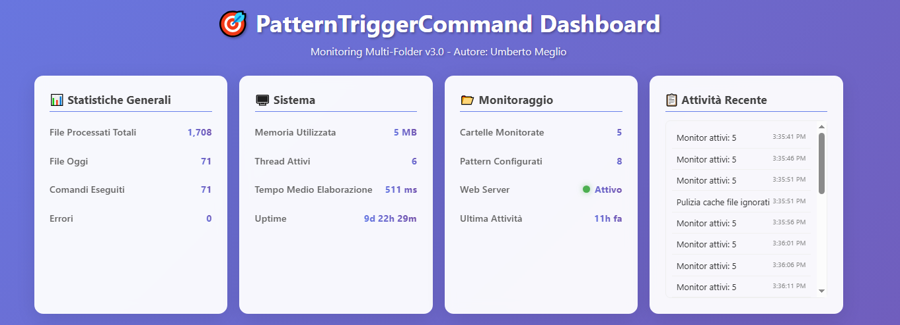

# PatternTriggerCommand Multi-Folder v3.0

**Autore: Umberto Meglio - Supporto allo sviluppo: Claude di Anthropic**



## Panoramica

PatternTriggerCommand e' un servizio Windows che monitora cartelle multiple per file corrispondenti a pattern regex ed esegue automaticamente comandi associati. Include una dashboard web integrata per il monitoraggio in tempo reale e uno **schedulatore parametrico** per l'esecuzione pianificata di comandi.

## Funzionalita' Principali

### Monitoraggio Multi-Cartella
- Monitoraggio nativo di cartelle diverse con configurazioni pattern specifiche
- Espressioni regolari per identificare i file di interesse
- Esecuzione automatica di comandi al rilevamento di file corrispondenti
- Database persistente dei file processati per evitare duplicati

### Schedulatore Parametrico
- **Trigger settimanale**: selezione giorni (Lu, Ma, Me, Gi, Ve, Sa, Do)
- **Trigger orario**: ore specifiche (es: 1,6,12,18)
- **Trigger al minuto**: minuti specifici (es: 0,15,30,45)
- **Modalita' intervallo**: ripeti ogni N secondi (minimo 5 sec)
- Configurazione su filesystem in file `.sch`
- Pagina web dedicata con CRUD completo
- Storico esecuzioni con filtri per nome e stato

### Dashboard Web
- Interfaccia responsive HTML5 con tema chiaro
- Top bar azzurro Napoli con striscia tricolore
- Statistiche in tempo reale: file processati, comandi, errori, memoria, uptime
- Tabelle cartelle monitorate e pattern configurati
- Feed attivita' recente con timestamp
- Auto-aggiornamento ogni 2 secondi

### Pagina Schedulatore
- Gestione task: crea, modifica, duplica, elimina
- Toggle attiva/disattiva per ogni task
- Selettore file: scansiona `C:\Scripts` per `.bat`, `.cmd`, `.exe`, `.ps1`
- Switch tra modalita' programmata (giorno/ora/minuto) e intervallo (ogni N secondi)
- Storico esecuzioni con filtro per nome task e stato (successo/errore)
- Chip interattivi per selezione giorni della settimana

### REST API
- `GET /` - Dashboard principale
- `GET /scheduler` - Pagina gestione schedulatore
- `GET /api/metrics` - Metriche di sistema in JSON
- `GET /api/scheduler` - Task schedulati e storico in JSON
- `GET /api/scheduler/scripts` - Elenco script disponibili
- `POST /api/scheduler/save` - Salva/modifica task
- `POST /api/scheduler/delete` - Elimina task
- `POST /api/scheduler/toggle` - Attiva/disattiva task

## Quick Start

### Compilazione
```bash
# Con MinGW nel PATH
mingw32-make

# Oppure percorso completo
G:\mingw32\bin\mingw32-make.exe
```

### Installazione Servizio
```bash
PatternTriggerCommand.exe install
```

### Test in Console
```bash
PatternTriggerCommand.exe test
```
Apri `http://localhost:8080` per la dashboard e `http://localhost:8080/scheduler` per lo schedulatore.

## Configurazione

Il servizio crea automaticamente il file di configurazione `C:\PTC\config.ini`:

```ini
[Settings]
DefaultMonitoredFolder=C:\Monitored
LogFile=C:\PTC\PatternTriggerCommand.log
DetailedLogFile=C:\PTC\PatternTriggerCommand_detailed.log
ProcessedFilesDB=C:\PTC\PatternTriggerCommand_processed.txt
DetailedLogging=true
WebServerPort=8080
WebServerEnabled=true
SchedulerEnabled=true
SchedulerFolder=C:\PTC\schedules

[Patterns]
# Formato esteso: Cartella|Pattern|Comando
Pattern1=C:\Invoices\Incoming|^invoice.*\.pdf$|C:\Scripts\process_invoice.bat
Pattern2=C:\Reports\Monthly|^[0-9]{8}_.*DEMAT.*\.csv$|C:\Scripts\process_demat.bat

# Formato legacy: Pattern|Comando (usa cartella default)
Pattern3=^backup.*\.zip$|C:\Scripts\process_backup.bat
```

### Configurazione Schedulatore

I task schedulati sono file `.sch` nella cartella `C:\PTC\schedules\`:

```ini
# Esempio: C:\PTC\schedules\Backup_giornaliero.sch
Name=Backup giornaliero
Enabled=true
Days=Lu,Ma,Me,Gi,Ve
Hours=9,17
Minutes=0,30
Command=C:\Scripts\backup.bat
Interval=0
```

**Modalita' intervallo** (ripeti ogni N secondi):
```ini
Name=Health check
Enabled=true
Command=C:\Scripts\health_check.bat
Interval=300
```

Quando `Interval` e' > 0, i campi Days/Hours/Minutes vengono ignorati e il task viene eseguito ogni N secondi.

## Interfaccia Web

### Dashboard (`http://localhost:8080`)

La dashboard mostra in tempo reale:

| Sezione | Contenuto |
|---------|-----------|
| Stat Cards | File processati, file oggi, comandi eseguiti, errori, memoria, thread, uptime, ultima attivita' |
| Monitoraggio | Cartelle monitorate, pattern configurati, stato web server e schedulatore |
| Attivita' Recente | Feed eventi con timestamp |
| Cartelle | Tabella con stato, percorso, file rilevati/processati |
| Pattern | Tabella con nome, cartella, regex, match, esecuzioni |

### Schedulatore (`http://localhost:8080/scheduler`)

| Sezione | Contenuto |
|---------|-----------|
| Stat Cards | Stato schedulatore, task totali, task attivi, esecuzioni totali |
| Tab Task | Tabella task con nome, stato, tipo (programmato/intervallo), programmazione, comando, azioni |
| Tab Storico | Log esecuzioni con data/ora, task, comando, esito, codice uscita |
| Form Modifica | Nome, modalita' (giorno-ora-minuto o intervallo), selezione giorni, ore, minuti, selettore file |

**Azioni disponibili per ogni task:**
- **Avvia/Stop** - attiva o disattiva il task
- **Mod** - apri form di modifica
- **Dup** - duplica il task con nome "(copia)"
- **Elim** - elimina il task (con conferma)

## Comandi CLI

```bash
PatternTriggerCommand.exe install              # Installa come servizio Windows
PatternTriggerCommand.exe uninstall            # Rimuovi servizio
PatternTriggerCommand.exe test                 # Modalita' console (CTRL+C per uscire)
PatternTriggerCommand.exe status               # Stato servizio e configurazione
PatternTriggerCommand.exe reset                # Reset database file processati
PatternTriggerCommand.exe config               # Crea/aggiorna configurazione
PatternTriggerCommand.exe reprocess <dir> <f>  # Riprocessa un file specifico
```

## Make Targets

```bash
mingw32-make            # Compila il progetto
mingw32-make debug      # Compila versione debug
mingw32-make release    # Compila versione release ottimizzata
mingw32-make install    # Compila e installa servizio
mingw32-make test       # Compila e avvia in console
mingw32-make status     # Verifica stato servizio
mingw32-make clean      # Pulisci file compilati
mingw32-make reset      # Reset database
mingw32-make setup      # Setup completo ambiente
mingw32-make deploy     # Deploy per produzione
```

## Esempi Pattern

### Documenti Aziendali
```ini
Pattern1=C:\Fatture|^(invoice|INV)_[0-9]{4}.*\.pdf$|C:\Scripts\process_invoice.bat
Pattern2=C:\Banca|^[0-9]{8}_.*DEMAT.*\.csv$|C:\Scripts\import_banking.bat
Pattern3=C:\Contratti|^contract_.*_signed\.pdf$|C:\Scripts\archive_contract.bat
```

### Operazioni IT
```ini
Pattern1=C:\Logs|^app_[0-9]{8}_[0-9]{6}\.log$|C:\Scripts\analyze_logs.bat
Pattern2=C:\Backups|^db_backup_.*\.sql\.gz$|C:\Scripts\verify_backup.bat
Pattern3=C:\Config|^config_v[0-9]+\.[0-9]+\.xml$|C:\Scripts\deploy_config.bat
```

## Architettura Tecnica

- **Linguaggio**: C++11 con MinGW
- **Piattaforma**: Windows 7+ / Server 2008 R2+
- **Thread**: Multi-thread con mutex per thread safety
- **Web Server**: HTTP integrato con socket Windows (Winsock2)
- **Monitoraggio**: `ReadDirectoryChangesW` asincrono per ogni cartella
- **Schedulatore**: Thread dedicato con check ogni 15 secondi (sleep frazionato per shutdown rapido)
- **Librerie**: advapi32, kernel32, user32, ws2_32, psapi (incluse in Windows)
- **Build**: Makefile con MinGW, linking statico per portabilita'

## Struttura Directory

```
C:\PTC\
  config.ini                           # Configurazione principale
  PatternTriggerCommand.log            # Log attivita'
  PatternTriggerCommand_detailed.log   # Log dettagliato
  PatternTriggerCommand_processed.txt  # Database file processati
  schedules\                           # Task schedulati
    Backup_giornaliero.sch
    Health_check.sch
    ...

C:\Scripts\                            # Script eseguibili
  process_invoice.bat
  backup.bat
  ...
```

## Requisiti di Sistema

- **OS**: Windows 7/Server 2008 R2 o superiore
- **Compilatore**: MinGW con supporto C++11
- **Permessi**: Amministratore per installazione servizio
- **Rete**: Porta configurabile (default 8080) per dashboard web

## Licenza

MIT License - Vedi file LICENSE per i dettagli.

---

*PatternTriggerCommand v3.0 - Monitoraggio multi-cartella con schedulatore parametrico e dashboard web integrata.*
