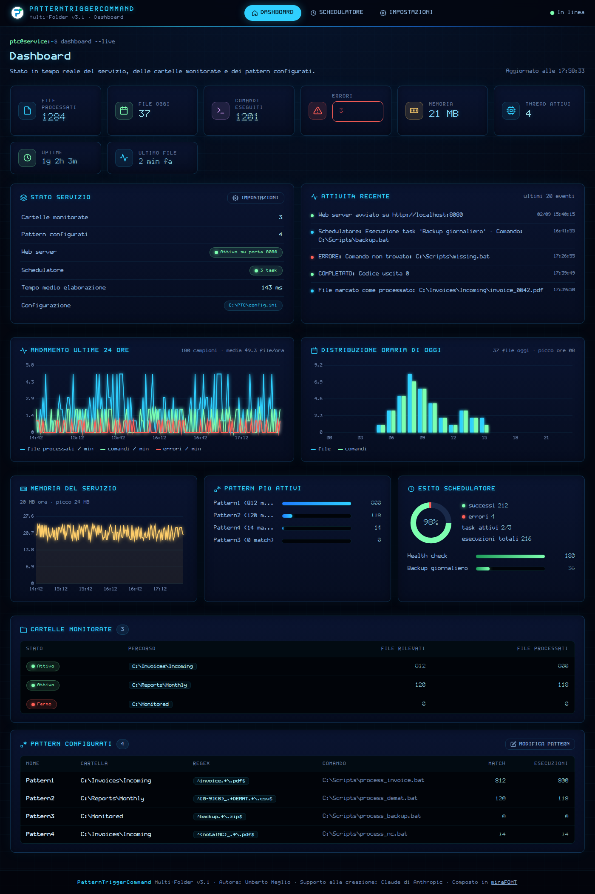

# PatternTriggerCommand Multi-Folder v3.1

> 🇮🇹 Questo documento è disponibile anche in italiano: **[README.it.md](README.it.md)**
>
> 🌐 Project page: **[umeglio.github.io/PatternTriggerCommand](https://umeglio.github.io/PatternTriggerCommand/)**

[](#technical-architecture)
[](#technical-architecture)
[](#technical-architecture)
[](#compiling)
[](LICENSE)
[](https://github.com/umeglio/miraFONT)

**Author:** Umberto Meglio
**Built with the support of:** Claude by Anthropic
**Current version:** 3.1
**License:** [MIT](LICENSE)



---

## Overview

PatternTriggerCommand is a native C++ Windows service that watches multiple folders for files matching regular-expression patterns and automatically runs the associated commands, passing the file as parameter. It ships with an integrated web dashboard for real-time monitoring, a **parametric scheduler** for planned command execution and a **settings page** that edits the service configuration and applies it on the fly.

Everything lives in a single statically linked executable: no .NET, no Java, no external libraries. The dashboard is set in [miraFONT](https://github.com/umeglio/miraFONT), embedded in the binary, so it renders identically on a server with no internet access.

## Main Features

### Multi-Folder Monitoring
- Native monitoring of different folders, each with its own pattern set
- Regular expressions to identify the files of interest (case-insensitive, full-name match, `|` alternations allowed when the folder is explicit)
- Automatic command execution when a matching file appears, with initial scan of files already present
- Persistent database of processed files to avoid duplicates; waits for the file to be released before running the command

### Parametric Scheduler
- **Weekly trigger**: day selection (Lu, Ma, Me, Gi, Ve, Sa, Do)
- **Hourly trigger**: specific hours (e.g. 1,6,12,18)
- **Minute trigger**: specific minutes (e.g. 0,15,30,45)
- **Interval mode**: repeat every N seconds (minimum 5 s)
- Filesystem configuration in `.sch` files
- Dedicated web page with full CRUD
- Execution history with filters by name and outcome

### Web Dashboard
- Responsive HTML5 interface with the dark "miraNET" theme, the same look as umeglio.github.io
- Typography entirely in **miraFONT** (Spline for text and headings, Linear for code and prompts, Dots for numbers), embedded in the executable
- Real-time statistics: processed files, commands, errors, memory, threads, uptime
- Charts: last 24 hours (files, commands and errors per minute), today's hourly distribution, service memory, most active patterns, scheduler outcome
- Monitored folders and configured patterns tables, recent activity feed with real timestamps
- Connection indicator and toast notifications instead of pop-ups
- Auto-refresh every 2 seconds (charts every 15 seconds)

### Settings Page
- Edit the whole service configuration from the browser: folders, log files, processed-files database, detailed logging, scheduler, web server port and state
- Pattern table editor (name, folder, regex, command) with regex validation and a filename tester
- Atomic save to `config.ini` and **hot reload**: monitors restart without stopping the service; if the port changes, the web server restarts itself on the new address
- "Reload from disk" button to apply manual edits to the file

### REST API
- `GET /` - Main dashboard
- `GET /scheduler` - Scheduler management page
- `GET /settings` - Service settings page
- `GET /api/metrics` - System metrics in JSON
- `GET /api/stats` - Time series and statistics for the charts (one sample per minute, last 24 hours)
- `GET /api/config` - Current configuration in JSON
- `POST /api/config/save` - Save `config.ini` and apply the configuration on the fly
- `POST /api/config/reload` - Re-read `config.ini` from disk and restart the monitors
- `GET /api/scheduler` - Scheduled tasks and history in JSON
- `GET /api/scheduler/scripts` - Available scripts list
- `POST /api/scheduler/save` - Save/edit a task
- `POST /api/scheduler/delete` - Delete a task
- `POST /api/scheduler/toggle` - Enable/disable a task
- `GET /fonts/<name>.woff` - Embedded miraFONT files

## Quick Start

### Compiling
```bash
# With MinGW in PATH
mingw32-make

# Or with the full path
G:\mingw32\bin\mingw32-make.exe
```

The repository also ships a ready-to-run 32-bit static executable, `PatternTriggerCommand.exe`.

### Installing the Service
```bash
PatternTriggerCommand.exe install
```

### Console Test
```bash
PatternTriggerCommand.exe test
```
Open `http://localhost:8080` for the dashboard, `http://localhost:8080/scheduler` for the scheduler and `http://localhost:8080/settings` for the settings.

## Configuration

The service automatically creates the configuration file `C:\PTC\config.ini`:

```ini
[Settings]
DefaultMonitoredFolder=C:\Monitored
LogFile=C:\PTC\PatternTriggerCommand.log
DetailedLogFile=C:\PTC\PatternTriggerCommand_detailed.log
ProcessedFilesDB=C:\PTC\PatternTriggerCommand_processed.txt
DetailedLogging=true
WebServerPort=8080
WebServerEnabled=true
SchedulerEnabled=true
SchedulerFolder=C:\PTC\schedules

[Patterns]
# Extended format: Folder|Pattern|Command
Pattern1=C:\Invoices\Incoming|^invoice.*\.pdf$|C:\Scripts\process_invoice.bat
Pattern2=C:\Reports\Monthly|^[0-9]{8}_.*DEMAT.*\.csv$|C:\Scripts\process_demat.bat

# Legacy format: Pattern|Command (uses the default folder)
Pattern3=^backup.*\.zip$|C:\Scripts\process_backup.bat
```

### Scheduler Configuration

Scheduled tasks are `.sch` files in the `C:\PTC\schedules\` folder:

```ini
# Example: C:\PTC\schedules\Backup_giornaliero.sch
Name=Daily backup
Enabled=true
Days=Lu,Ma,Me,Gi,Ve
Hours=9,17
Minutes=0,30
Command=C:\Scripts\backup.bat
Interval=0
```

**Interval mode** (repeat every N seconds):
```ini
Name=Health check
Enabled=true
Command=C:\Scripts\health_check.bat
Interval=300
```

When `Interval` is > 0, the Days/Hours/Minutes fields are ignored and the task runs every N seconds.

## Web Interface

### Dashboard (`http://localhost:8080`)

| Section | Content |
|---------|---------|
| Stat cards | Processed files, files today, commands executed, errors, memory, threads, uptime, last file |
| Service state | Monitored folders, configured patterns, web server and scheduler state, average processing time, configuration file |
| Recent activity | Event feed with timestamps |
| Charts | Last 24 hours, today's hourly distribution, memory, most active patterns, scheduler outcome |
| Folders | Table with state, path, detected/processed files |
| Patterns | Table with name, folder, regex, command, matches, executions |

### Settings (`http://localhost:8080/settings`)

| Section | Content |
|---------|---------|
| Paths | Default monitored folder, task folder, log file, detailed log, processed-files database |
| Service | Switches for detailed logging / scheduler / web server, web server port |
| Patterns and commands | Editable pattern table with regex tester, add and remove rows |
| Save bar | Unsaved-changes indicator, "Discard changes", "Save and apply" |

Saving rewrites `C:\PTC\config.ini` and asks the service to reload itself on the fly: folder monitors are stopped and restarted with the new patterns, the scheduler re-reads its folder and, if the port or the web server state changed, the web server is restarted. Disabling the web server from the page makes the dashboard unreachable: re-enable it from `config.ini`.

### Scheduler (`http://localhost:8080/scheduler`)

| Section | Content |
|---------|---------|
| Stat cards | Scheduler state, total tasks, active tasks, total executions |
| Tasks tab | Task table with name, state, type (scheduled/interval), schedule, command, actions |
| History tab | Execution log with date/time, task, command, outcome, exit code |
| Edit form | Name, mode (day-hour-minute or interval), day selection, hours, minutes, file picker |

**Actions available for each task:**
- **Start/Stop** - enable or disable the task
- **Edit** - open the edit form
- **Duplicate** - clone the task as "(copia)"
- **Delete** - remove the task (with confirmation)

## CLI Commands

```bash
PatternTriggerCommand.exe install              # Install as Windows service
PatternTriggerCommand.exe uninstall            # Remove the service
PatternTriggerCommand.exe test                 # Console mode (CTRL+C to exit)
PatternTriggerCommand.exe status               # Service state and configuration
PatternTriggerCommand.exe reset                # Reset the processed-files database
PatternTriggerCommand.exe config               # Create/update the configuration
PatternTriggerCommand.exe reprocess <dir> <f>  # Reprocess a specific file
```

## Make Targets

```bash
mingw32-make            # Build the project
mingw32-make debug      # Debug build
mingw32-make release    # Optimised release build
mingw32-make fonts      # Regenerate miraFONT_embedded.h (Python 3)
mingw32-make install    # Build and install the service
mingw32-make test       # Build and run in console
mingw32-make status     # Check service state
mingw32-make clean      # Remove build files
mingw32-make reset      # Reset the database
mingw32-make setup      # Full environment setup
mingw32-make deploy     # Production deploy
```

## Pattern Examples

### Business Documents
```ini
Pattern1=C:\Fatture|^(invoice|INV)_[0-9]{4}.*\.pdf$|C:\Scripts\process_invoice.bat
Pattern2=C:\Banca|^[0-9]{8}_.*DEMAT.*\.csv$|C:\Scripts\import_banking.bat
Pattern3=C:\Contratti|^contract_.*_signed\.pdf$|C:\Scripts\archive_contract.bat
```

### IT Operations
```ini
Pattern1=C:\Logs|^app_[0-9]{8}_[0-9]{6}\.log$|C:\Scripts\analyze_logs.bat
Pattern2=C:\Backups|^db_backup_.*\.sql\.gz$|C:\Scripts\verify_backup.bat
Pattern3=C:\Config|^config_v[0-9]+\.[0-9]+\.xml$|C:\Scripts\deploy_config.bat
```

## Web Server

The built-in web server serves each connection on a dedicated thread, reads requests in full (headers and body according to `Content-Length`) and sends responses to the last byte: pages no longer arrive truncated and POST requests are no longer lost, defects of version 3.0 where the accepted socket inherited the non-blocking mode of the listening one. Regular expressions in the configuration file may contain `|` (alternations) when the folder is explicit.

## miraFONT

The WOFF files in `fonts/miraFONT/` (CC0 licence, from https://github.com/umeglio/miraFONT) are embedded in the executable through the `miraFONT_embedded.h` header, generated with:

```bash
python tools/embed_fonts.py      # or: mingw32-make fonts
```

## Project Page

The `docs/` folder contains the bilingual project page published at https://umeglio.github.io/PatternTriggerCommand/ by the `deploy-pages.yml` workflow (GitHub Pages with "GitHub Actions" as source). The page picks Italian or English from the browser language and remembers the visitor's choice.

## Technical Architecture

- **Language**: native C++11 with MinGW, Win32 API, Winsock2, PSAPI
- **Platform**: Windows 7+ / Server 2008 R2+
- **Threads**: multi-threaded with mutexes for thread safety
- **Web server**: built-in HTTP/1.1 on Windows sockets, one thread per connection
- **Monitoring**: `ReadDirectoryChangesW` for every folder
- **Scheduler**: dedicated thread checking every 15 seconds (fractional sleep for fast shutdown)
- **Libraries**: advapi32, kernel32, user32, ws2_32, psapi (all part of Windows)
- **Build**: Makefile with MinGW, static linking for portability

## Directory Structure

```
PatternTriggerCommand/
├── PatternTriggerCommand.cpp   # Complete source code
├── PatternTriggerCommand.exe   # Ready 32-bit static executable
├── miraFONT_embedded.h         # Embedded fonts (generated)
├── fonts/miraFONT/             # WOFF files and CC0 licence
├── tools/embed_fonts.py        # Header generator
├── docs/                       # Project page (GitHub Pages)
├── Makefile                    # Build system
├── README.md                   # This document (English)
└── README.it.md                # Italian documentation
```

## License

MIT License - see [LICENSE](LICENSE) for details.

---

**Author:** Umberto Meglio — **Built with the support of:** Claude by Anthropic
